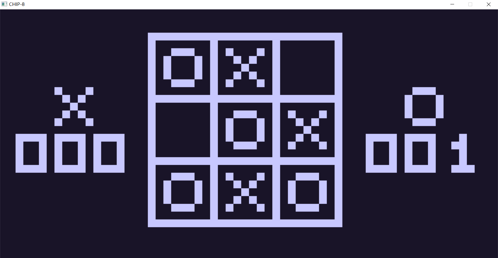

# mychip8
*A CHIP-8 game console emulator implemented with rust.*




## Install 
Download *mychip.zip* from the [release](https://github.com/night-cruise/mychip8/releases) page and unzip it.


## Usage
Enter `mychip8 - h` on the command line to view the detailed usage commands:
```text
mychip8 0.1.0
A CHIP-8 game console emulator

USAGE:
    main.exe [FLAGS] <GAME_PATH>

FLAGS:
    -h, --help                 Prints help information
    -p, --print-instruction    Prints the instructions
    -V, --version              Prints version information

ARGS:
    <GAME_PATH>    game path
```


## Game Source

* https://www.zophar.net/pdroms/chip8.html


## References

* https://blog.wjdevschool.com/blog/video-game-console-emulator/
* http://devernay.free.fr/hacks/chip8/C8TECH10.HTM
* https://github.com/W-J-Dev-School/CHIP-8-Emulator
* https://github.com/mattmikolay/chip-8/wiki/Mastering-CHIP%E2%80%908
* https://github.com/mattmikolay/chip-8/wiki/CHIP%E2%80%908-Technical-Reference


## LICENSE

This project is licensed under the MIT License (see the
[LICENSE](LICENSE) file for details).
